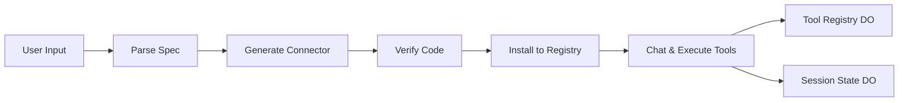

# Cloudflare AI ToolSmith

Transform API specifications into production-ready Cloudflare Workers connectors in minutes. ToolSmith pairs an end-to-end workflow UI with Workers AI so teams can ingest a spec, generate a typed connector, validate the exports, and deploy the result to the Cloudflare edge without leaving the browser.

## Architecture



- `workers/index.ts` routes API traffic, streams logs, and orchestrates AI/tool calls.
- `workers/parser.ts` normalizes OpenAPI/GraphQL/text into the Common Spec Model.
- `workers/generator.ts` prompts Workers AI to emit ES module connectors.
- `workers/verifier.ts` checks generated exports before installation.
- `workers/durable_objects` holds chat history (`SessionState`) and installed connectors (`ToolRegistry`).
- `ui/pages/index.tsx` surfaces the full workflow, visual editor, live logs, and chat.

## Highlights

- **Visual Spec Editor** – Drag endpoints from the parsed Common Spec Model into a canvas to generate connectors and see relationships at a glance.
- **Scenario Suite** – Save sandbox requests, schedule recurring smoke runs, and trigger them from chat with “rerun smoke suite”.
- **Real-time Console** – Stream structured logs over SSE alongside chat responses for rapid iteration.
- **Prompt Controls** – Tweak parse/generate prompts from the Insights page to guide the LLM for specific APIs.

## Workflow

1. **Parse** – Upload a spec via drag-and-drop; the worker returns a Common Spec Model summary.
2. **Generate** – Use the visual editor or endpoint list to invoke Workers AI and build connector code.
3. **Verify** – Run static export checks and smoke tests inside the worker runtime.
4. **Install** – Persist verified connectors in the Tool Registry Durable Object.
5. **Collaborate** – Chat with the AI assistant, visualize endpoints, and save sandbox scenarios that can be replayed or scheduled.

## User Input

- Specification uploads (OpenAPI, GraphQL introspection, JSON, XML, plain text).
- Chat prompts that can trigger connector execution or re-run the smoke suite.
- Sandbox test forms and saved scenarios for recurring API checks.
- Prompt customization from the Insights page for parse and generate steps.

## Memory & State

- **SessionState Durable Object** – Stores per-session chat history and saved sandbox scenarios, including latest run results and cadence.
- **ToolRegistry Durable Object** – Persists installed connectors, compiled modules, and metadata for invocation.
- **AnalyticsTracker Durable Object** – Captures workflow analytics (parse/generate/verify/install/test events).
- In-browser state keeps UI selections (persona, endpoint detail, scenario drafts) scoped to the current session.

## LLM Used

- `@cf/meta/llama-3.3-70b-instruct-fp8-fast` via Workers AI powers:
  - Connector generation (`/api/generate`).
  - Tool selection heuristics inside chat when auto-invocation is enabled.
  - Conversational responses in `/api/chat`.
- Deterministic verification and installation steps run without LLM involvement.

## Quickstart

```bash
git clone https://github.com/<your-org>/cf_ai_toolsmith.git
cd cf_ai_toolsmith
npm install
(cd ui && npm install)

npm run dev      # worker on http://localhost:8787
npm run dev:ui   # UI on http://localhost:3000 (proxies /api/*)
```

Prerequisites:
- Node.js 18+
- Cloudflare account with Workers AI and Durable Objects enabled
- Wrangler CLI authenticated to your account (`wrangler login`)

Deploy with `wrangler deploy`, then build the UI (`cd ui && npm run build`) and host `ui/dist` (Cloudflare Pages recommended).

## Testing

```bash
npm test               # Full suite
npm run test:unit
npm run test:integration
npm run test:e2e
```

## Learn More

- `docs/QUICK_REFERENCE.md` – Shortcuts for running the workflow end-to-end.
- `docs/WORKFLOW_COMPLETE.md` – Detailed walkthrough of the connector pipeline.
- `docs/CHAT_FEATURE.md` – Deep dive on chat-driven tool execution and personas.

## License

Distributed under the MIT License. See `LICENSE` for details.
