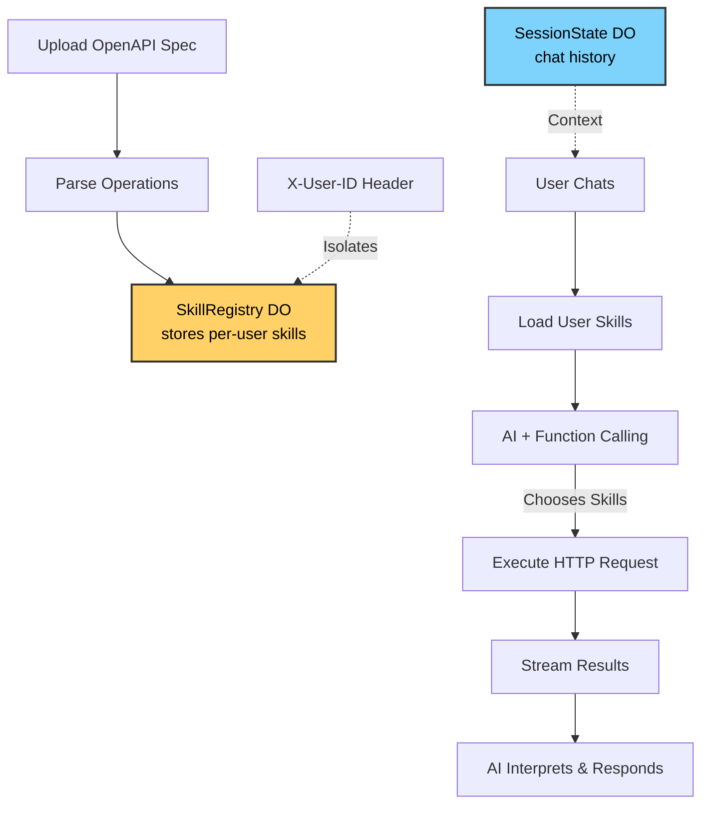
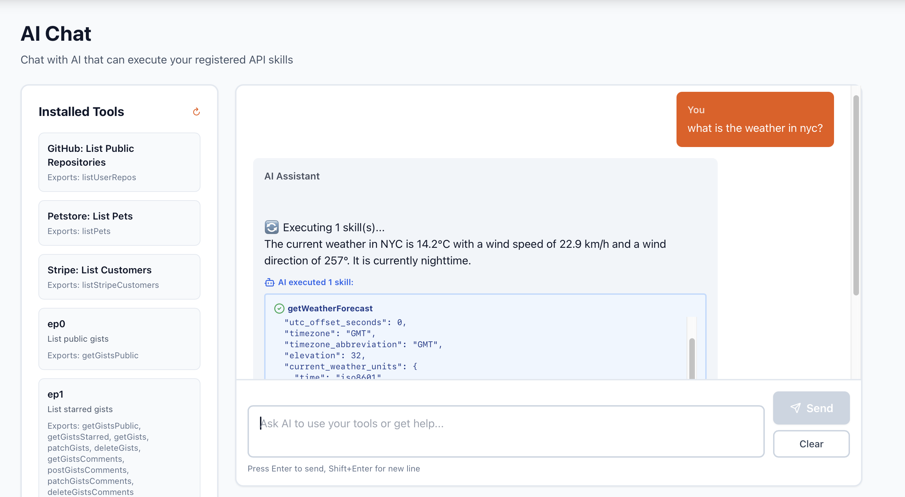
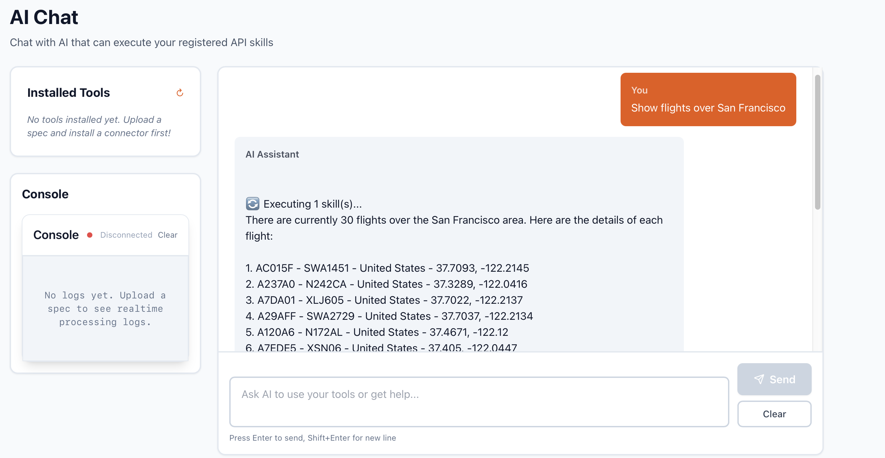

# Cloudflare AI ToolSmith


Give AI agents instant access to any API. Upload an OpenAPI specification, and chat with an AI that can autonomously execute your APIs in real-time.

## 🌐 Live Demo

**Try it now (no setup required):**

- **Frontend:** https://main.toolsmith-ui.pages.dev

Sample APIs are pre-loaded. Just open the link and start chatting!

## Overview

ToolSmith is an AI agent platform built on Cloudflare Workers that transforms OpenAPI specifications into executable AI skills. Upload an API spec, and an AI assistant gains the ability to call those APIs during conversations—executing real HTTP requests and returning results without writing code.

## Architecture



## One-Minute Quickstart

```bash
git clone https://github.com/lesprgm/cf_ai_toolsmith.git && cd cf_ai_toolsmith
npm install && (cd ui && npm install)
echo "ENCRYPTION_KEY=$(openssl rand -base64 32)" > .dev.vars
npm run dev &    # Start worker on http://localhost:8787
npm run dev:ui   # Start UI on http://localhost:5173
# Open http://localhost:5173 → Upload examples/petstore.yaml → Chat: "List available pets"
```


_AI autonomously calling a weather API skill during conversation_


_AI autonomously calling a flight tracking API skill during conversation_

## How to Run Everything

### Required Environment Setup

**1. Environment Variables**

```bash
# Create .dev.vars file (for local development):
ENCRYPTION_KEY=<32-character-random-string>   # Generate: openssl rand -base64 32
ENVIRONMENT=development
LOG_LEVEL=debug

# For production deployment:
wrangler secret put ENCRYPTION_KEY            # Same key for production
```

**2. Durable Objects Configuration**

Required bindings in `wrangler.toml`:

```toml
[[durable_objects.bindings]]
name = "SESSION_STATE"
class_name = "SessionState"
script_name = "cf-ai-toolsmith"

[[durable_objects.bindings]]
name = "SKILL_REGISTRY"
class_name = "SkillRegistry"
script_name = "cf-ai-toolsmith"

# Migration required on first deploy:
[[migrations]]
tag = "v1"
new_classes = ["SessionState", "SkillRegistry"]
```

**3. Workers AI Binding**

Model used: `@cf/meta/llama-3.3-70b-instruct-fp8-fast`

```toml
[ai]
binding = "AI"
```

**4. Multi-Tenancy Header**

All API requests must include:

```
X-User-ID: <unique-user-identifier>
```

This header isolates skills and chat history per user. Each unique `X-User-ID` maps to a separate Durable Object instance.

### Quick Verification

```bash
# 1. Start services
npm run dev      # Worker on :8787
npm run dev:ui   # UI on :5173

# 2. Test worker health
curl http://localhost:8787/api/health

# 3. Test skill registration
curl -X POST http://localhost:8787/api/skills/register \
  -H "X-User-ID: test-user" \
  -H "Content-Type: application/json" \
  -d '{"apiName":"Test","spec":{...},"baseUrl":"https://api.example.com"}'

# 4. Test chat (requires registered skills)
curl -X POST http://localhost:8787/api/chat \
  -H "X-User-ID: test-user" \
  -H "Content-Type: application/json" \
  -d '{"message":"Hello"}'
```

### Core Components

- **SkillRegistry DO** - Per-user API skill storage with encrypted credentials
- **Skill Parser** - Converts OpenAPI specs to AI tool schemas, executes skills via HTTP
- **Chat Orchestrator** - Loads skills, orchestrates function calling, streams results
- **SessionState DO** - Maintains conversation history per session
- **Skills UI** - Upload, manage, and delete registered APIs
- **Chat UI** - Real-time streaming chat with skill execution display

## Workflow

### 1. Register APIs as Skills

Upload OpenAPI Spec → System parses operations → Skills stored per-user

```plaintext
Example: Upload GitHub's OpenAPI spec
Result: 200+ operations become AI skills (listRepositories, createIssue, etc.)
```

### 2. Chat with Skill-Enabled AI

User Question → AI loads your skills → AI chooses appropriate skill(s) → Executes HTTP request → Streams results

```plaintext
User: "What's the weather in NYC?"

AI process:
1. Loads user's registered Weather API skill
2. Chooses: getCurrentWeather(city="New York")
3. Executes: GET https://api.weather.com/current?city=New+York
4. Returns: {"temp": 68, "conditions": "Sunny"}
5. Responds: "The current weather in NYC is 68°F and sunny."
```

### 3. Multi-Skill Orchestration

AI can chain multiple skills autonomously:

```plaintext
User: "Find all Cloudflare repos with >1000 stars and save to Airtable"

AI executes:
1. listRepositories(org="cloudflare")
2. Filters locally: stars > 1000
3. createRecords(base="projects", records=[...])
```

## User Input

### Skills Page

1. Click "Skills" in navigation
2. Upload OpenAPI spec (JSON/YAML) or paste directly
3. Enter API name (e.g., "Weather API")
4. Enter API key (if required)
5. Click "Register API"
6. View registered skills in table

### Chat Page

1. Click "Chat" in navigation
2. Type natural language queries
3. Watch AI autonomously execute skills
4. See detailed results before AI's response

### Example Interactions

**Single API:**

```
User: "What's the weather in Paris?"
AI: Executes getCurrentWeather(location="Paris")
```

**Multi-API:**

```
User: "List my GitHub starred repos about 'ai' and save to Airtable"
AI: Executes listStarredRepos() → filters → createRecords()
```

## Memory & State

### Durable Objects Storage

**SkillRegistry** (`workers/durable_objects/SkillRegistry.ts`)

- Stores per-user registered APIs and their skills
- Key structure: `user:{userId}` → UserSkills object
- Contains: API name, base URL, encrypted API key, skill definitions
- Multi-tenant isolation via `X-User-ID` header

**SessionState** (`workers/durable_objects/SessionState.ts`)

- Maintains chat conversation history per session
- Key structure: `history` → Message[] array
- Enables context-aware conversations across page refreshes
- Auto-trimmed when history exceeds token limits

### Data Flow

```
User uploads spec → SkillRegistry DO stores skills
User chats → Worker loads skills from SkillRegistry
AI function calls → Worker executes HTTP request
Results → SessionState DO stores in history
```

## LLM Integration

### Model

**`@cf/meta/llama-3.3-70b-instruct-fp8-fast`** via Cloudflare Workers AI

### Function Calling

```javascript
// 1. Load user's skills
const skills = await loadUserSkills(userId);

// 2. Convert to OpenAI-compatible tool schemas
const tools = skillsToAIToolSchemas(skills);

// 3. AI call with tools
const response = await AI.run(model, {
  messages: [...history, userMessage],
  tools: tools,
  tool_choice: "auto",
});

// 4. AI returns tool calls, worker executes them
if (response.tool_calls) {
  for (const call of response.tool_calls) {
    const result = await executeSkill(call.name, call.arguments);
  }
}
```

### Capabilities

- Autonomous function calling based on user intent
- Parameter extraction from natural language
- Multi-turn context using chat history
- Error interpretation and recovery
- Multi-skill orchestration
- Streaming responses via Server-Sent Events

### Decision-Making

- **When to use skills**: Based on user intent and available operations
- **Which skill to use**: Matches query to skill descriptions
- **What parameters to pass**: Extracts from query or requests clarification
- **How to handle errors**: Retries or explains limitations

## Getting Started

### Prerequisites

- Node.js 18+
- Cloudflare account with Workers AI and Durable Objects enabled
- Wrangler CLI authenticated (`wrangler login`)

### Local Development

```bash
git clone https://github.com/lesprgm/cf_ai_toolsmith.git
cd cf_ai_toolsmith
npm install
(cd ui && npm install)

npm run dev
npm run dev:ui
```

### Deploy to Production

```bash
wrangler deploy
cd ui && npm run build
npx wrangler pages deploy dist --project-name=toolsmith
```

See [DEPLOYMENT.md](DEPLOYMENT.md) for complete instructions.

## Testing

```bash
npm test                  # Run full suite (124 tests)
npm run test:unit         # Unit tests
npm run test:integration  # Integration tests
npm run test:coverage     # Coverage report
```

## Technical Stack

**Backend:**

- Cloudflare Workers (V8 isolates)
- Llama 3.3 70B via Workers AI
- Durable Objects (SkillRegistry, SessionState)

**Frontend:**

- React 18 with TypeScript
- Vite build tool
- Tailwind CSS

**Testing:**

- Vitest (124 passing tests)

## License

MIT License - see [LICENSE](LICENSE) for details.
