# 🛠️ Cloudflare AI ToolSmith

> Transform API specifications into production-ready Cloudflare Workers connectors in minutes.

[](https://opensource.org/licenses/MIT)
[](https://nodejs.org/)
[](https://workers.cloudflare.com/)

ToolSmith pairs an end-to-end workflow UI with Workers AI so teams can ingest a spec, generate a typed connector, validate the exports, and deploy the result to the Cloudflare edge—all without leaving the browser.

## 📋 Table of Contents

- [Architecture](#-architecture)
- [Key Features](#-key-features)
- [Workflow](#-workflow)
- [Quickstart](#-quickstart)
- [User Input](#-user-input)
- [Memory & State](#-memory--state)
- [LLM Integration](#-llm-integration)
- [Testing](#-testing)
- [Documentation](#-documentation)
- [License](#-license)

## 🏗️ Architecture

```mermaid
graph TD
    A[👤 User Upload / Chat] -->|Spec file| B[🔍 /api/parse]
    B -->|Common Spec Model| C[🤖 /api/generate]
    C -->|Generated Connector| D[✅ /api/verify]
    D -->|Validated Code| E[📦 /api/install]
    E --> F[(🗄️ ToolRegistry DO)]
    F --> G[💬 /api/chat]
    G --> H[⚙️ Execute Tool Call]
    A --> I[📡 /api/stream SSE]
    I --> J[🖥️ Workflow Console]
    G --> K[(📝 SessionState DO)]
    G --> L[🧪 Scenario Suite]
    
    style F fill:#f9f,stroke:#333,stroke-width:2px
    style K fill:#f9f,stroke:#333,stroke-width:2px
    style C fill:#bbf,stroke:#333,stroke-width:2px
```



### Core Components

| Component | Purpose |
|-----------|---------|
| **`workers/index.ts`** | Routes API traffic, streams logs, orchestrates AI/tool calls |
| **`workers/parser.ts`** | Normalizes OpenAPI/GraphQL/text into Common Spec Model |
| **`workers/generator.ts`** | Prompts Workers AI to emit ES module connectors |
| **`workers/verifier.ts`** | Validates generated exports before installation |
| **`workers/durable_objects`** | Manages chat history (`SessionState`) and connectors (`ToolRegistry`) |
| **`ui/pages/index.tsx`** | Full workflow UI with visual editor, logs, and chat |

## ✨ Key Features

### 🎨 Visual Spec Editor
Drag endpoints from the parsed Common Spec Model into a canvas to generate connectors and visualize API relationships at a glance.

### 🧪 Scenario Suite
Save sandbox requests, schedule recurring smoke tests, and trigger them from chat with natural language commands like "rerun smoke suite".

### 📊 Real-time Console
Stream structured logs over SSE alongside chat responses for rapid debugging and iteration.

### 🎯 Prompt Controls
Customize parse/generate prompts from the Insights page to fine-tune LLM behavior for specific APIs.

## 🔄 Workflow

```
┌─────────┐    ┌──────────┐    ┌────────┐    ┌─────────┐    ┌────────────┐
│  Parse  │ -> │ Generate │ -> │ Verify │ -> │ Install │ -> │ Collaborate│
└─────────┘    └──────────┘    └────────┘    └─────────┘    └────────────┘
```

1. **📤 Parse** – Upload a spec via drag-and-drop; the worker returns a Common Spec Model summary.
2. **⚙️ Generate** – Use the visual editor or endpoint list to invoke Workers AI and build connector code.
3. **✅ Verify** – Run static export checks and smoke tests inside the worker runtime.
4. **📦 Install** – Persist verified connectors in the Tool Registry Durable Object.
5. **🤝 Collaborate** – Chat with the AI assistant, visualize endpoints, and save sandbox scenarios that can be replayed or scheduled.

## 📥 User Input

ToolSmith accepts multiple input types:

- **📄 Specification uploads**: OpenAPI, GraphQL introspection, JSON, XML, plain text
- **💬 Chat prompts**: Trigger connector execution or re-run the smoke suite
- **🧪 Sandbox test forms**: Create and save scenarios for recurring API checks
- **⚙️ Prompt customization**: Fine-tune parse and generate steps from the Insights page

## 💾 Memory & State

### Durable Objects

| Object | Purpose |
|--------|---------|
| **SessionState** | Stores per-session chat history and saved sandbox scenarios, including latest run results and cadence |
| **ToolRegistry** | Persists installed connectors, compiled modules, and metadata for invocation |
| **AnalyticsTracker** | Captures workflow analytics (parse/generate/verify/install/test events) |

### Browser State
In-browser state keeps UI selections (persona, endpoint detail, scenario drafts) scoped to the current session.

## 🤖 LLM Integration

**Model**: `@cf/meta/llama-3.3-70b-instruct-fp8-fast` via Workers AI

This powers:
- ⚙️ Connector generation (`/api/generate`)
- 🎯 Tool selection heuristics inside chat when auto-invocation is enabled
- 💬 Conversational responses in `/api/chat`

> **Note**: Deterministic verification and installation steps run without LLM involvement.

## 🚀 Quickstart

### Prerequisites

- **Node.js** 18 or higher
- **Cloudflare account** with Workers AI and Durable Objects enabled
- **Wrangler CLI** authenticated to your account

```bash
# Authenticate with Cloudflare
wrangler login
```

### Installation

```bash
# Clone the repository
git clone https://github.com/lesprgm/cf_ai_toolsmith.git
cd cf_ai_toolsmith

# Install dependencies
npm install
cd ui && npm install && cd ..

# Start the development servers
npm run dev      # Worker on http://localhost:8787
npm run dev:ui   # UI on http://localhost:3000 (proxies /api/*)
```

### Deployment

```bash
# Deploy the worker
wrangler deploy

# Build and deploy the UI
cd ui
npm run build
# Upload ui/dist to Cloudflare Pages
```

> **Tip**: Cloudflare Pages is recommended for hosting the UI with automatic deployments.

## 🧪 Testing

ToolSmith includes comprehensive test coverage:

```bash
# Run all tests
npm test

# Run specific test suites
npm run test:unit         # Unit tests
npm run test:integration  # Integration tests
npm run test:e2e          # End-to-end tests

# Watch mode for development
npm run test:watch

# Generate coverage report
npm run test:coverage
```

## 📚 Documentation

Explore detailed guides for specific features:

| Document | Description |
|----------|-------------|
| **[Quick Reference](docs/QUICK_REFERENCE.md)** | Shortcuts for running the workflow end-to-end |
| **[Complete Workflow](docs/WORKFLOW_COMPLETE.md)** | Detailed walkthrough of the connector pipeline |
| **[Chat Feature](docs/CHAT_FEATURE.md)** | Deep dive on chat-driven tool execution and personas |

## 🤝 Contributing

We welcome contributions! Please feel free to submit issues and pull requests.

1. Fork the repository
2. Create your feature branch (`git checkout -b feature/amazing-feature`)
3. Commit your changes (`git commit -m 'Add some amazing feature'`)
4. Push to the branch (`git push origin feature/amazing-feature`)
5. Open a Pull Request

## 📄 License

Distributed under the MIT License. See [`LICENSE`](LICENSE) for details.

---

<div align="center">
  <strong>Built with ❤️ using Cloudflare Workers AI</strong>
</div>
